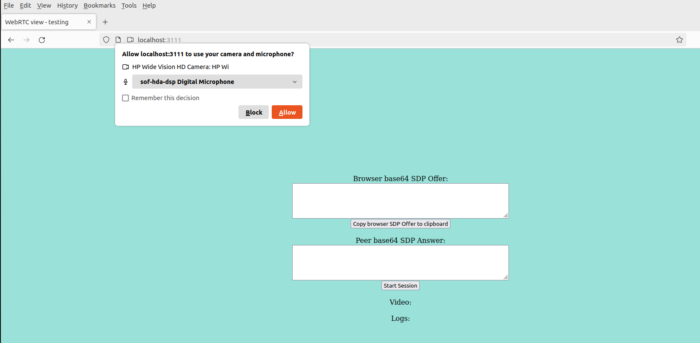

# Client WebRTC Testing

This is a client-side web application used to test WebRTC connections with other peers. The application can be launched by running the following command:

`go run .`

Once launched, the server will start on port 3111, and the application can be accessed at http://localhost:3111

